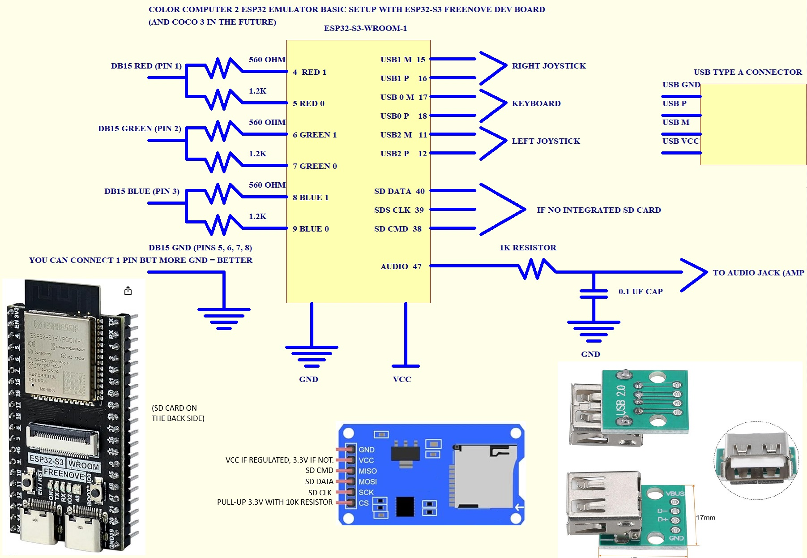

# ESP32 CoCo 2 Emulator

An experimental **TRS-80 Color Computer 2 (CoCo 2)** emulator running on an **ESP32-S3-WROOM-1** development board.  
This project aims to bring a functional CoCo 2 emulation experience to affordable and accessible ESP32 hardware.

---

## ⚠️ Beta Release

This is an early **beta release**.

Many core features are working, but there are still known issues and likely undiscovered bugs.  
The goal is to allow the community to test, experiment, and help improve the emulator together.

---

## 🛠 Hardware Requirements

- ESP32-S3-WROOM-1 development board
- Reference wiring diagram included below

I am currently working on:

- An official custom PCB  
- A 3D-printable enclosure inspired by the original CoCo design (without integrated keyboard)

---

## 📦 Installation / Build

This project uses **PlatformIO**:

There is many tutorials about howto install/use PlatformIO for ESP32.

## Usage

**F12** — Enter the emulator menu

---

## ✅ Currently Working Features

- Floppy disk read / write  
- Sound output  
- USB keyboard support  
- USB joystick support  
- Most video modes (some obscure modes still need identification)  
- NTSC artifact color generation  
- CPU emulation speed mostly accurate (sometimes slightly too fast, affecting audio)  
- V-SYNC interrupt handling  
- 32K Upper RAM fully implemented

---

## 🚧 Features To Be Implemented

- Proper handling of the two Data Direction Registers (`FF00` and `FF02`)  
- H-SYNC interrupt handling (usage in CoCo software uncertain)

---

## 🐞 Known Issues

- System crash when copying a file from one disk to another  Exemple:  COPY"TEST.BAS:0" TO "TEST.BAS:1"
- Occasional misaligned screen flickering in some games (likely V-SYNC or video buffer sync issue)  
- Audio playback speed inconsistencies (possibly non cycle-accurate CPU emulation or incomplete interrupt handling)

---

## 📊 Wiring Diagram

This diagram shows the basic connections required to run the emulator on the ESP32-S3-WROOM-1 development board.

---

## 🛠 Roadmap

- Stable beta release  
- Official PCB design and 3D-printed case  
- Improved video and audio synchronization  
- Implement remaining obscure video modes  
- Proper interrupt handling (H-SYNC & Data Direction Registers)

-After all major issues fixed, I will start working on the CoCo 3 version (Using the same hardware).  I already have a KIND-OF working PROOF-OF-CONCEPT code for the CoCo 3. 
---

## 🧩 Contribution

This project is open for **personal use and community testing**.  
If you want to contribute:

- Report issues via GitHub Issues  
- Suggest features or improvements  
- Submit pull requests